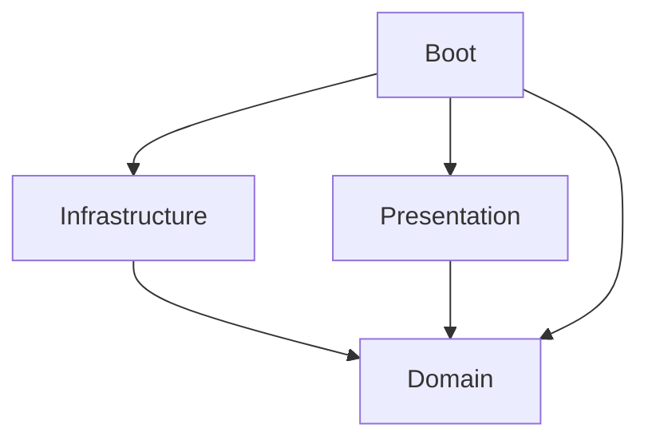

# Kotlin Server Template
This project is a server code template using Kotlin, Gradle, and Ktor.
It aims to help you build a service by providing reusable code examples that is likely essential for a server.

## Tech stack
* [Kotlin](https://kotlinlang.org) as a main language.
  * [kotlinx.coroutines](https://github.com/Kotlin/kotlinx.coroutines) for asynchronous, non-blocking programming.
  * [kotlinx.serialization](https://github.com/Kotlin/kotlinx.serialization) for serialization.
* [Gradle](https://gradle.org) as a build tool.
  * Kotlin DSL as well.
* [Ktor](https://ktor.io) as a server framework.
* [Logback](https://logback.qos.ch) for logging.
* [Typesafe Config](https://github.com/lightbend/config) for configuration using HOCON files.
* [Arrow Core](https://arrow-kt.io/docs/core/) for type-safe error handling.
  * Uses only basic features such as `Either`.

## Architecture
This project consists of several Gradle subprojects separated based on Domain-driven design (DDD) as below.

### [domain](subproject/domain)
Domain contains pure conceptual business logic implemented in Kotlin code which uses limited and minimal external dependencies.
### [infrastructure](subproject/infrastructure)
Infrastructure contains actual implementations of domain interfaces which use external dependencies such as database, network, and libraries that possibly be replaced.
### [presentation](subproject/presentation)
Presentation provides domain functions as actual network APIs.
It contains logic to support network protocols such as HTTP, gRPC and also API serialization / deserialization for domain.
### [boot](subproject/boot)
Boot depends on all other subprojects and connects implementations of them to run a server application.
In other words, it is responsible for dependency injection (DI).
It also contains several resource files to run a server.
### Other subprojects
* [logging](subproject/logging) provides logback library dependency and configuration of it for global use in the project.

## Gradle Setting
[Root build.gradle.kts](build.gradle.kts) contains settings commonly shared to all subprojects, and also several task settings for the entire application.
* Common external library dependencies
* Main class definition
* Tasks that build a fat jar and containerize it.

Each subproject's build.gradle.kts contains settings only for its own subproject.
* Dependencies for the subproject.
* Several plugin settings for the subproject.
