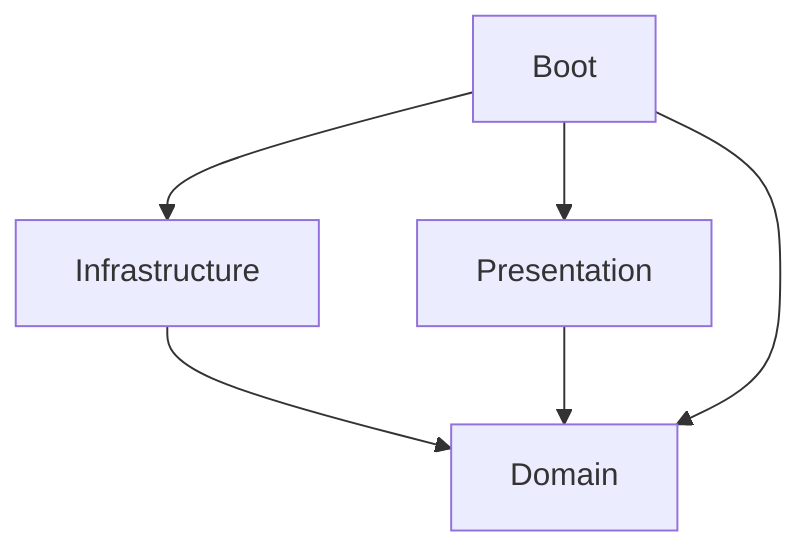

# Kotlin Server Template
This project is a server code template using Kotlin, Gradle, and Ktor.
It aims to help you build a service by providing reusable code examples that is likely essential for a server.

## Tech stack
* [Kotlin](https://kotlinlang.org) as a main language.
  * [kotlinx.coroutines](https://github.com/Kotlin/kotlinx.coroutines) for asynchronous, non-blocking programming.
  * [kotlinx.serialization](https://github.com/Kotlin/kotlinx.serialization) for serialization.
* [Gradle](https://gradle.org) as a build tool.
  * Kotlin DSL as well.
* [Ktor](https://ktor.io) as a server framework.
* [Logback](https://logback.qos.ch) for logging.
* [Typesafe Config](https://github.com/lightbend/config) for configuration using HOCON files.
* [Arrow Core](https://arrow-kt.io/docs/core/) for type-safe error handling.
  * Uses only basic features such as `Either`.
* [Spring Data R2DBC](https://spring.io/projects/spring-data-r2dbc) and [PostgreSQL](http://postgresql.org) for persistence.
  * Uses Spring Data R2DBC as a client of R2DBC, but does not depend on Spring IoC or Spring Boot.
  * Uses `r2dbc-pool` to manage database connections, `r2dbc-postgresql` as a R2DBC driver.
* [Testcontainers](https://www.testcontainers.org) for integration testing.

## Architecture
This project consists of several Gradle subprojects separated based on Domain-driven design (DDD) as below.

### [domain](subproject/domain)
Domain contains pure conceptual business logic implemented in Kotlin code which uses limited and minimal external dependencies.
### [infrastructure](subproject/infrastructure)
Infrastructure contains actual implementations of domain interfaces which use external dependencies such as database, network, and libraries that possibly be replaced.
### [presentation](subproject/presentation)
Presentation provides domain functions as actual network APIs.
It contains logic to support network protocols such as HTTP, gRPC and also API serialization / deserialization for domain.
### [boot](subproject/boot)
Boot depends on all other subprojects and connects implementations of them to run a server application.
In other words, it is responsible for dependency injection (DI).
It also contains several resource files to run a server.
### Other subprojects
* [logging](subproject/logging) provides logback library dependency and configuration of it for global use in the project.

## Gradle Setting
[Root build.gradle.kts](build.gradle.kts) contains settings commonly shared to all subprojects, and also several task settings for the entire application.
* Common external library dependencies
* Main class definition
* Tasks that build a fat jar and containerize it.

Each subproject's build.gradle.kts contains settings only for its own subproject.
* Dependencies for the subproject.
* Several plugin settings for the subproject.

## Testing
Examples of unit test, integration test, and end-to-end test are all included in this project.
* Unit tests are usually written for entities, services in domain layer.
  * [UserSpec](subproject/domain/src/test/kotlin/io/github/doohochang/ktserver/entity/UserSpec.kt)
  * [UserServiceSpec](subproject/domain/src/test/kotlin/io/github/doohochang/ktserver/service/UserServiceSpec.kt)
* Integration tests are usually written for repositories in infrastructure layer by using Testcontainers.
  * [RepositorySpec](subproject/infrastructure/src/test/kotlin/io/github/doohochang/ktserver/repository/RepositorySpec.kt)
* End-to-end tests are written in boot layer usually for testing the server APIs.
  * [EndToEndSpec](subproject/boot/src/test/kotlin/io/github/doohochang/ktserver/EndToEndTestSpec.kt)

## Server API
The server provides simple API examples as follows.
* `GET /greeting/{name}`
  ```
  > curl -X GET http://localhost:8080/greeting/alice
  HTTP/1.1 200 OK
  Content-Type: text/plain; charset=UTF-8
  Hello, alice.
  ```
* `GET /users/{id}`
  ```
  > curl -X GET http://localhost:8080/users/existing-user
  HTTP/1.1 200 OK
  Content-Type: application/json; charset=UTF-8
  {"id":"existing-user","name":"..."}
  
  > curl -X GET http://localhost:8080/users/non-existing-user
  HTTP/1.1 404 Not Found
  ```
* `POST /users/{id}`: Creates a user.
  ```
  > curl -i -X POST http://localhost:8080/users -H "Content-Type: application/json" -d '{ "name": "bob" }'
  HTTP/1.1 200 OK
  Content-Type: application/json; charset=UTF-8
  {"id":"some-random-id","name":"bob"}
  
  > curl -i -X POST http://localhost:8080/users -H "Content-Type: application/json" -d '{ "name": "!@" }'
  HTTP/1.1 400 Bad Request
  Content-Type: text/plain; charset=UTF-8
  User name must be alphanumeric.
  ```
* `PATCH /users/{id}`: Updates a user.
  ```
  > curl -i -X PATCH http://localhost:8080/users/existing-user -H "Content-Type: application/json" -d '{ "name": "charlie" }'
  HTTP/1.1 200 OK
  Content-Type: application/json; charset=UTF-8
  {"id":"existing-user","name":"charlie"}
  
  > curl -i -X POST http://localhost:8080/users/existing-user -H "Content-Type: application/json" -d '{ "name": "!@" }'
  HTTP/1.1 400 Bad Request
  Content-Type: text/plain; charset=UTF-8
  User name must be alphanumeric.
  
  > curl -i -X POST http://localhost:8080/users/non-existing-user -H "Content-Type: application/json" -d '{ "name": "damien" }'
  HTTP/1.1 404 Not Found
  ```
* `DELETE /users/{id}`
  ```
  > curl -i -X DELETE http://localhost:8080/users/existing-user
  HTTP/1.1 200 OK
  
  > curl -i -X POST http://localhost:8080/users/non-existing-user
  HTTP/1.1 404 Not Found
  ```
